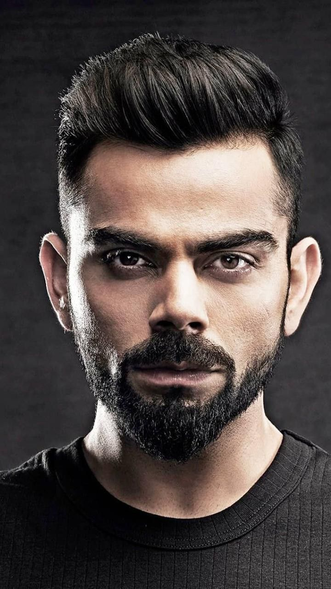
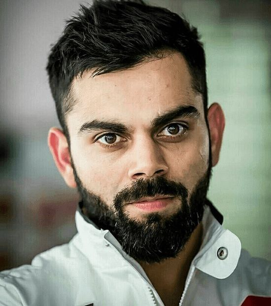
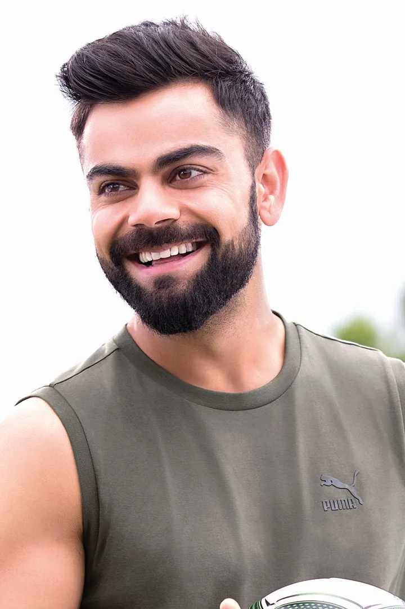
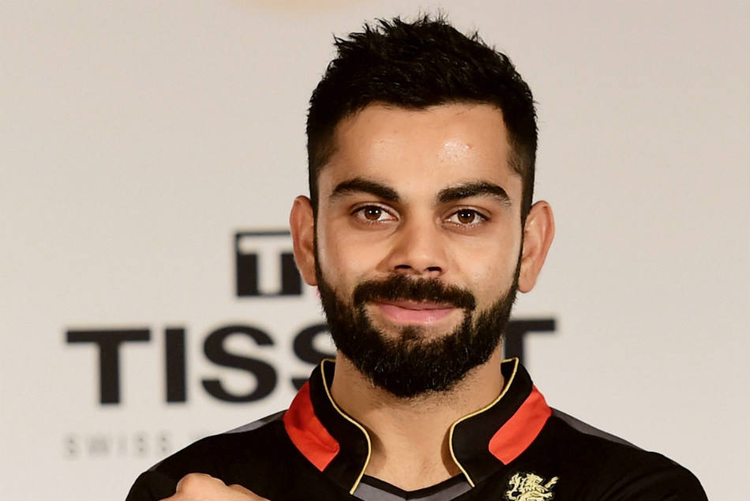
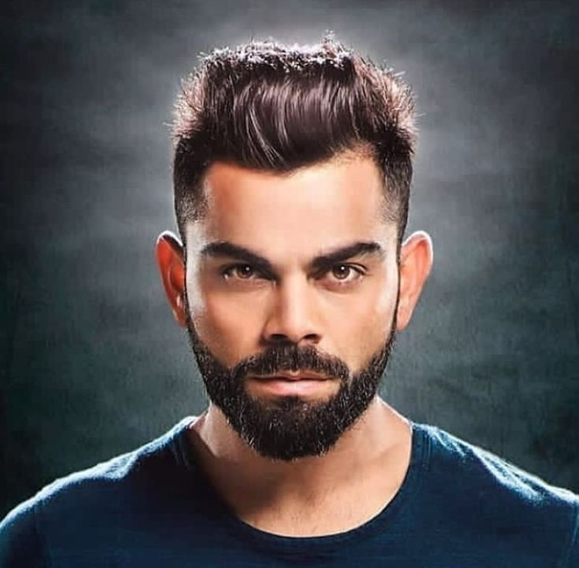
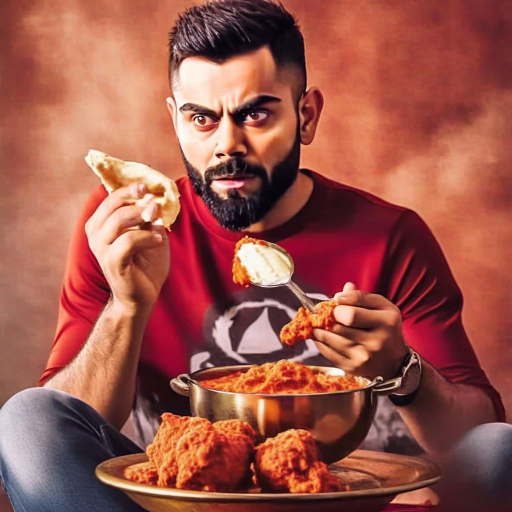
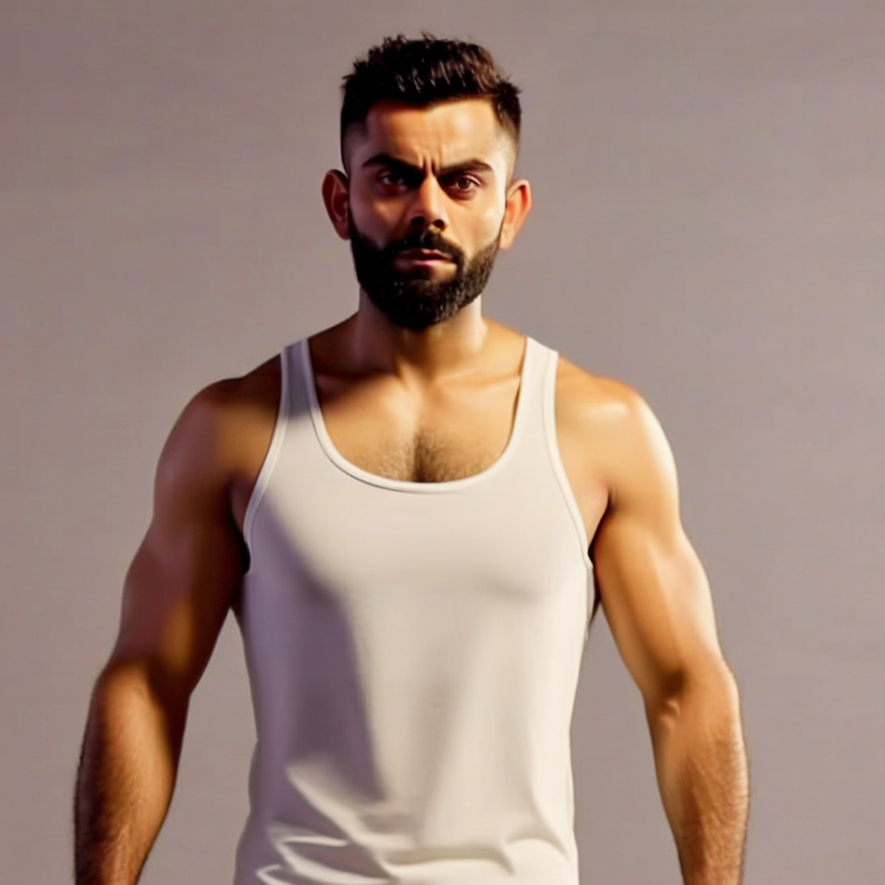

# Fine-tuned Stable Diffusion Model for Virat Kohli

This repository contains a fine-tuned Stable Diffusion model, specifically the SDXL 1.0 version, trained to generate images of the famous Indian cricketer Virat Kohli. The model was fine-tuned using the Dreambooth technique, which involves training a pre-existing model on a few images of the subject to capture their likeness and characteristics.

# Training Data

The model was trained on a set of 6 images of Virat Kohli, which are included in the `Original` folder of this repository. These images cover different angles, expressions, and contexts, providing a diverse representation of the subject.


<div style="display: grid; grid-template-columns: repeat(3, 1fr); grid-gap: 10px;">
  
  
  
  
  
  
</div>

## Training Process

The model was fine-tuned using the following command:

```
!autotrain dreambooth \
  --model ${MODEL_NAME} \
  --project-name ${PROJECT_NAME} \
  --image-path images/ \
  --prompt "${PROMPT}" \
  --resolution ${RESOLUTION} \
  --batch-size ${BATCH_SIZE} \
  --num-steps ${NUM_STEPS} \
  --gradient-accumulation ${GRADIENT_ACCUMULATION} \
  --lr ${LEARNING_RATE} \
  --mixed-precision ${MIXED_PRECISION} \
  $( [[ "$USE_FP16" == "True" ]] && echo "--fp16" ) \
  $( [[ "$USE_XFORMERS" == "True" ]] && echo "--xformers" ) \
  $( [[ "$TRAIN_TEXT_ENCODER" == "True" ]] && echo "--train-text-encoder" ) \
  $( [[ "$USE_8BIT_ADAM" == "True" ]] && echo "--use-8bit-adam" ) \
  $( [[ "$GRADIENT_CHECKPOINTING" == "True" ]] && echo "--gradient-checkpointing" ) \
  $( [[ "$PUSH_TO_HUB" == "True" ]] && echo "--push-to-hub --token ${HF_TOKEN} --repo-id ${REPO_ID}" )
```

## Generated Images

After training, the fine-tuned model can generate new images of Virat Kohli based on text prompts. Here are some examples of generated images stored in the `Gen` folder:

<div style="display: flex; flex-wrap: nowrap; justify-content: space-around;">
  <div style="text-align: center;">
    
    <p>Prompt: Virat Kohli wearing sunglasses</p>
  </div>
  <div style="text-align: center;">
    
    <p>Prompt: Virat Kohli as army personnel</p>
  </div>
  <div style="text-align: center;">
    
    <p>Prompt: Virat Kohli eating butter chicken</p>
  </div>
  <div style="text-align: center;">
    
    <p>Prompt: Virat Kohli ripped muscles</p>
  </div>
</div>

## Image Generation

You can generate new images using the following code snippet:

```python
prompt = "photo of Virat Kohli wearing hoodie and sneakers, 4k, ultra realistic, natural blur"

for seed in range(6):
    generator = torch.Generator("cuda").manual_seed(seed)
    image = pipe(prompt=prompt, generator=generator, num_inference_steps=25).images[0]
    image.save(f"GenImages/{seed}.png")
    displayImg(path)
```

## Model Details

- **Base Model**: Stable Diffusion SDXL 1.0
- **Fine-tuning Technique**: Dreambooth
- **Training Data**: 6 images of Virat Kohli
- **Deployment**: Private deployment on Hugging Face

## Usage

To use this fine-tuned model, you'll need to set up the appropriate environment and dependencies. The model can be accessed through the Hugging Face private deployment (access details will be provided upon request).

Once set up, you can generate new images of Virat Kohli by providing text prompts to the model. For example:

```
prompt = "Virat Kohli batting on a cricket field, 4k, ultra realistic"
image = model(prompt)
```

Please note that this is a private deployment, and access to the model may be restricted.

## Contributing

Contributions to this project are welcome. If you have additional training data or suggestions for improving the model's performance, feel free to open an issue or submit a pull request.

## License

This project is licensed under the [MIT License](LICENSE).

## Acknowledgments

- The Stable Diffusion team for their incredible work on the base model.
- The Hugging Face team for providing the infrastructure and tools for model deployment.
- The creators of the Dreambooth technique for enabling efficient fine-tuning of diffusion models.
